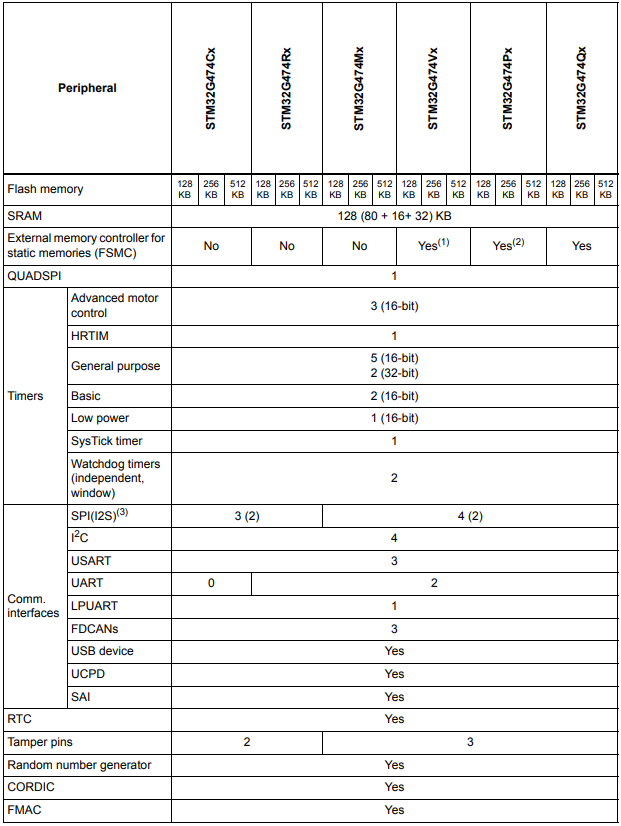
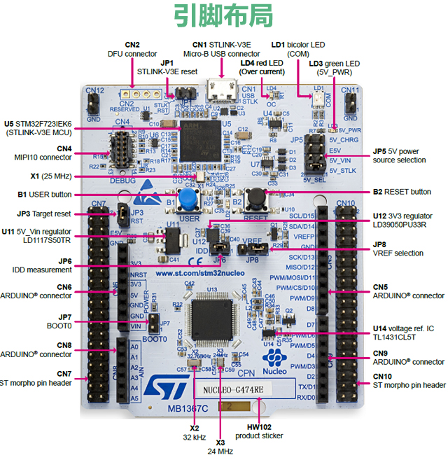

# [STM32G474](https://github.com/SoCXin/STM32G474)

* [ST](https://www.st.com/zh/): [Cortex-M4](https://github.com/SoCXin/Cortex)
* [L5R5](https://github.com/SoCXin/Level): 170 MHz (213DMIPS,550CoreMark)

## [简介](https://github.com/SoCXin/STM32G474/wiki)

[STM32G474](https://github.com/SoCXin/STM32G474) 高分辨率系列具有高分辨率定时器、复杂波形生成器和事件处理器（HRTIM），适用于数字开关电源、照明、焊接、太阳能和无线充电等数字电源转换应用,与STM32F3系列高度兼容。

### 关键特性

* 5个超快速12位ADC（4 Msamples/s）
* 7个12位DAC（15 Msamples/s）
* 7个超快速比较器（17纳秒）
* 6个具有可编程增益的运算放大器
* 最多3个CAN-FD
* USB Type-C接口以及物理层（PHY）

### [资源收录](https://github.com/SoCXin)

* [参考资源](src/)
* [参考文档](docs/)
* [参考工程](project/)

### [选型建议](https://github.com/SoCXin)

[STM32G474](https://www.st.com/zh/microcontrollers-microprocessors/stm32f2x7.html) 可应用于高速高精度的AD场景

* LQFP48 (7x7x1.4)
* LQFP64 (10x10x1.4)
* LQFP80 (12x12x1.4)
* LQFP100 (14x14x1.4)
* LQFP128 (14x14x1.4)

#### 相关开发板 (NUCLEO-G474RE)

#### 高完成度项目

* [Arduino_Core_STM32](https://github.com/stm32duino/Arduino_Core_STM32)

### [探索芯世界 www.SoC.xin](http://www.SoC.Xin)
