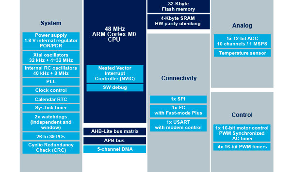

# [STM32F030](https://github.com/SoCXin/STM32F030)

#### [Vendor](https://github.com/SoCXin/Vendor)：[ST](https://github.com/SoCXin/ST)
#### [Core](https://github.com/SoCXin/Cortex)：[Cortex M0](https://github.com/SoCXin/CM0)
#### [Level](https://github.com/SoCXin/Level)：48MHz (0.95DMIPS/MHz)

## [描述](https://github.com/SoCXin/STM32F030)

[STM32F030](https://github.com/SoCXin/STM32F030)

### [资源收录](https://github.com/SoCXin/STM32F030)

* [文档](docs/)
* [资源](src/)

### [选型建议](https://github.com/SoCXin)

[STM32F030](https://github.com/SoCXin/STM32F030) 是入门级32位单片机，历史悠久资源丰富。

###  [SoC芯平台](http://www.SoC.Xin)
